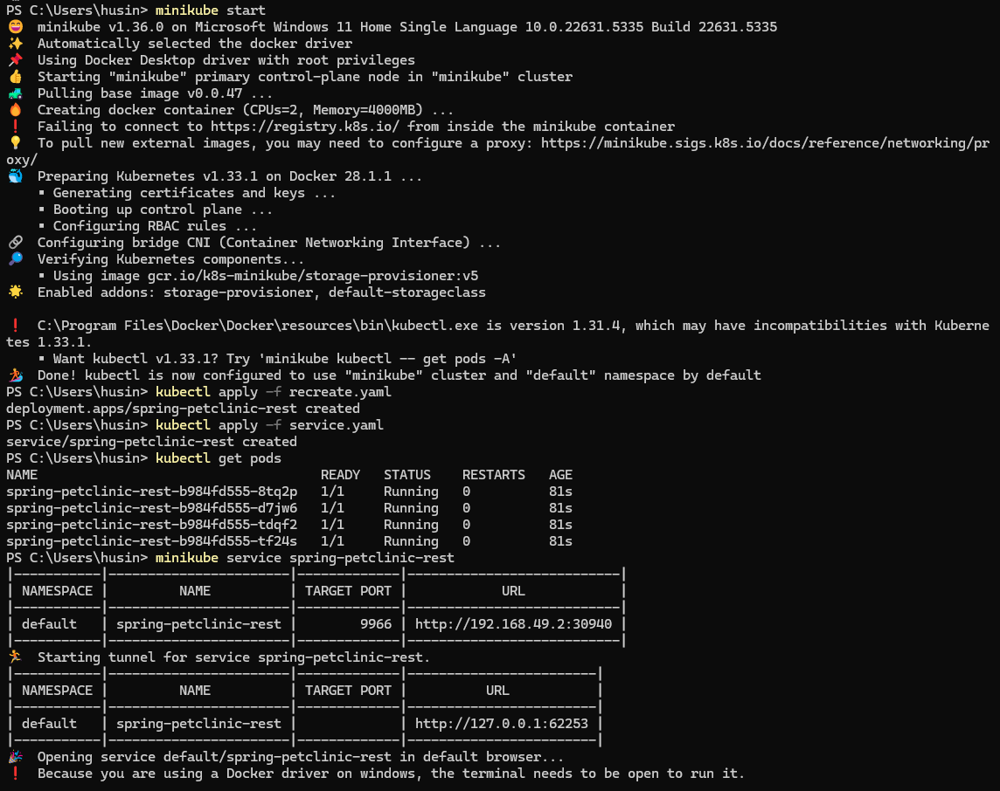

# Kubernetes Tutorial with Minikube - Learning Documentation

## Tutorial Overview

This document captures my experience completing the "Hello Minikube" and "Rolling Update Deployment" Kubernetes tutorials, including setup challenges, successful execution, and key learnings.

##  Tutorial: Hello Minikube

### Compare the application logs before and after you exposed it as a Service. Try to open the app several times while the proxy into the Service is running. What do you see in the logs? Does the number of logs increase each time you open the app?

* **Before Exposure:**

  * When examining the Pod logs using `kubectl logs hello-node-c74958b5d-pfskk` prior to Service creation, I found minimal output showing just the application initialization:

  * 

  * The logs revealed basic startup activity without any evidence of external connectivity or incoming requests.

* **After Exposure:**

  * Following Service deployment via `minikube service hello-node`, I repeatedly accessed the web application through my browser. The log analysis revealed new entries appearing with each page refresh, showing HTTP GET operations being handled by the Pod.

  * 

  * The comparison clearly shows how Service creation establishes external connectivity, allowing browser requests to reach the Pod and generate corresponding log entries for each user interaction.

### What is the purpose of the `-n` option and why did the output not list the pods/services that you explicitly created?

* My tutorial workflow included executing these kubectl commands:

  * `kubectl get pods`
  * `kubectl get pods -n kube-system`

* The first query operates within the **default namespace**, where my custom applications like `hello-node` are automatically placed during deployment.

* The namespace flag `-n kube-system` directs the query toward Kubernetes system components, including core services like DNS, proxy, and cluster management tools.

* My `hello-node` Pod remained invisible in the kube-system query because namespaces create separate resource boundaries. This hands-on experience revealed how Kubernetes uses namespaces as organizational containers, segregating different application types and maintaining clean resource separation across the cluster environment.

##  Tutorial: Rolling Update & Kubernetes Manifest File

### What is the difference between Rolling Update and Recreate deployment strategy?

* **Rolling Update Strategy:**

  * Rolling Update performs gradual replacement of application instances, maintaining service availability throughout the update process. During this deployment method, Kubernetes creates new Pods with the updated version while keeping existing Pods operational until the new ones become ready.

  * This approach ensures zero-downtime deployments since users can continue accessing the application through healthy Pods while others are being replaced. The process can be fine-tuned with parameters controlling how many Pods can be unavailable or created above the desired count.

* **Recreate Strategy:**

  * The Recreate strategy terminates all existing Pods simultaneously before creating new ones with the updated version. This results in a brief service interruption while no application instances are running.

  * While simpler to understand and implement, this method causes temporary downtime and is typically used when running multiple versions simultaneously could cause conflicts, such as during database schema migrations.

### Try deploying the Spring Petclinic REST using Recreate deployment strategy and document your attempt.

* **Deployment Process:**

  * I successfully deployed Spring Petclinic REST using the Recreate strategy by first creating the deployment and then modifying its strategy configuration.

  * The initial deployment was created with:
    ```bash
    kubectl create deployment spring-petclinic-rest --image=docker.io/springcommunity/spring-petclinic-rest:3.0.2
    ```

  * I then exported and modified the deployment configuration to use the Recreate strategy, scaling it to 4 replicas as specified in the `recreate.yaml` manifest file.

  * 

* **Observation During Update:**

  * When performing updates with the Recreate strategy, all existing Pods were terminated simultaneously before new ones started, creating a noticeable service interruption period.

  * The update process was faster than Rolling Update but came with the trade-off of temporary unavailability during the transition.

### Prepare different manifest files for executing Recreate deployment strategy.

* **Recreate Deployment Manifest (recreate.yaml):**

  * I created a manifest file that specifically configures the deployment to use the Recreate strategy. The key difference from a Rolling Update deployment is the `strategy.type: Recreate` specification.

  * The manifest includes 4 replicas running the Spring Petclinic REST application version 3.0.2, with the container port configured for 8080 as shown in my `recreate.yaml` file.

  * This configuration ensures that during updates, all existing Pods are terminated before new ones are created, demonstrating the Recreate deployment behavior.

### What do you think are the benefits of using Kubernetes manifest files?

* **Declarative Configuration Management:**

  * Manifest files provide a declarative approach to infrastructure management, eliminating the complexity of remembering multiple kubectl commands with various flags and parameters. Everything needed for deployment is clearly defined in readable YAML format.

  * This approach ensures consistency across different environments and reduces human errors that commonly occur during manual deployment processes.

* **Version Control and Collaboration:**

  * Storing manifest files in version control systems enables tracking infrastructure changes over time, facilitating team collaboration, and providing the ability to rollback to previous configurations when needed.

  * Infrastructure changes can be reviewed and approved through the same processes used for application code, improving overall system reliability.

* **Reproducibility and Automation:**

  * Manifest files enable identical deployments across multiple environments, supporting automated deployment pipelines and GitOps workflows where infrastructure changes are triggered by repository commits.

  * Compared to manual kubectl operations, manifest files serve as documentation of the intended system state and can be easily modified for different deployment scenarios or requirements.
