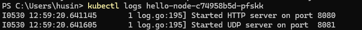
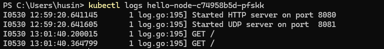

# Kubernetes Tutorial with Minikube - Learning Documentation

## Tutorial Overview

This document captures my experience completing the "Hello Minikube" Kubernetes tutorial, including setup challenges, successful execution, and key learnings.

## Reflection Questions & Answers

### Compare the application logs before and after you exposed it as a Service. Try to open the app several times while the proxy into the Service is running. What do you see in the logs? Does the number of logs increase each time you open the app?

* **Before Exposure:**

  * When examining the Pod logs using `kubectl logs hello-node-c74958b5d-pfskk` prior to Service creation, I found minimal output showing just the application initialization:

  * 

  * The logs revealed basic startup activity without any evidence of external connectivity or incoming requests.

* **After Exposure:**

  * Following Service deployment via `minikube service hello-node`, I repeatedly accessed the web application through my browser. The log analysis revealed new entries appearing with each page refresh, showing HTTP GET operations being handled by the Pod.

  * 

  * The comparison clearly shows how Service creation establishes external connectivity, allowing browser requests to reach the Pod and generate corresponding log entries for each user interaction.

### What is the purpose of the `-n` option and why did the output not list the pods/services that you explicitly created?

* My tutorial workflow included executing these kubectl commands:

  * `kubectl get pods`
  * `kubectl get pods -n kube-system`

* The first query operates within the **default namespace**, where my custom applications like `hello-node` are automatically placed during deployment.

* The namespace flag `-n kube-system` directs the query toward Kubernetes system components, including core services like DNS, proxy, and cluster management tools.

* My `hello-node` Pod remained invisible in the kube-system query because namespaces create separate resource boundaries. This hands-on experience revealed how Kubernetes uses namespaces as organizational containers, segregating different application types and maintaining clean resource separation across the cluster environment.
